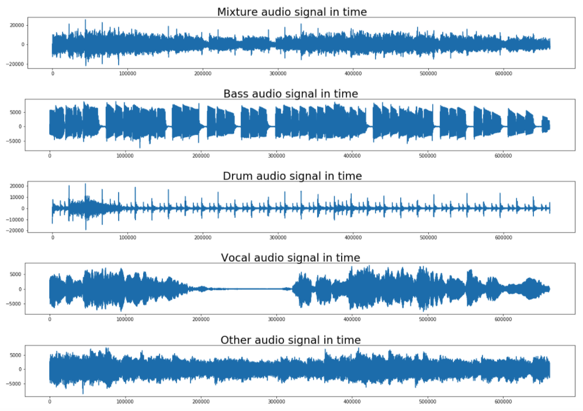

# Music Source Separation
>  MLSP Fall 2020 Project Repo for Team 5: "Music Source Separation Using Overcomplete Dictionary Representations of Audio Waveforms"

## Abstract:
We use supervised learning techniques to form custom bases for different music components (ex.  Vocals,Drums, Bass), which can be used to segregate the different sources from a mixed waveform. We explore someclassical techniques used in audio source separation, such as K-singular value decomposition (K-SVD) andnon-negative matrix factorization (NMF). To correctly handle phase information, a cyclic dictionary learningbased approach is taken to represent the time domain waveform, rather than a time-frequency representation.This attempts to implicitly encode phase information so that the linear mixer model is always valid. Our goalis to study a waveform based representation to validate if it is useful for music source separation.

## Dataset:
We use the musdb18 dataset https://zenodo.org/record/3338373#.X9bCOen0l24, which comprises of 150 full-length music tracks. Each track has its own isolated drums, bass, vocals, and others, which consists of the rest of the accompaniment) stems. mixture.wav corresponds to the sum of all the signals. All signals are stereophonic and encoded at 44.1kHz. Data is split into training and testing set with 100 and 50 songs respectively. We learn the representation of single song from several random 10 second duration chunks and  evaluate the separating capability on the different chunk of the same song. Since the representation is learned from a small chunk of a song, it is representative only of sources of that song. 

## Introduction:
Music Source Separation (MSS) is one of the essential tasks in signal processing research, which tackles the problem of separating several co-exist audio signals from a given mixture signal. The separated results can be further used in many other tasks such as instrument identification, automatic music transcription, information retrieval, and structured coding.

In this project, we consider the problem of MSS that separates a mixture into tracks consisting of Vocals, Drums, Bass and Other sources in waveform domain. The audio signals representing in time domain are shown in the following figure.

## Results: 
The original and separated audios can be found here https://drive.google.com/drive/folders/11-ZSrFAOEvCOxQjw4TkvBriijMzPjE8s?usp=sharing.

## Contributions:
Mohammed Danish is the author of the code and he has constructed the framework. All the team members worked collaboratively to write the code and tune the parameters via Colab.
